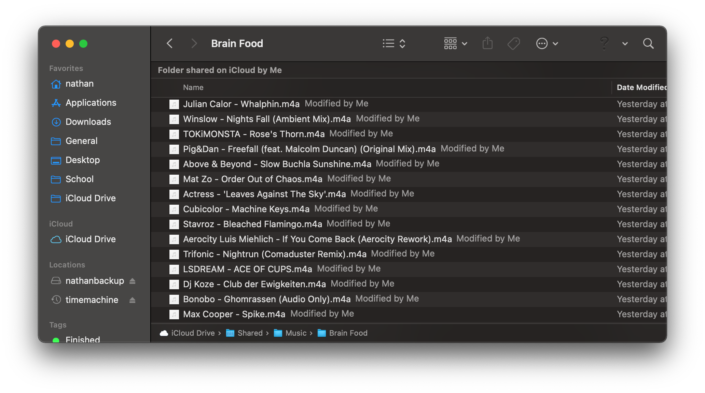

# tagger

**A library that tags music files using Spotify API or Discogs.**

### Quick start

1. Clone the repository

   ```bash
   git clone https://github.com/pynathanthomas/tagger.git
   ```

2. Install dependencies

   ```bash
   cd tagger; pip3 install -r requirements.txt
   ```


There are two options: tag an album or tag a bunch of random tracks in a directory.

#### tagging an album

```bash
python3 ~/tagger/tag_album.py '/path/to/album'
```

Use the `-s` or `-d` flags to specify searching in Spotify or Discogs, respectively.

```bash
python3 ~/tagger/tag_album.py -s '/path/to/album'
```

```bash
python3 ~/tagger/tag_album.py -d '/path/to/album'
```

#### tagging a playlist/random tracks

For this to work, the tracks have to be named using a pattern. For example,



these tracks are named using the `$artist - $track.m4a` pattern. 

A file named `Back in the U.S.S.R by The Beatles.flac` would have the pattern `$track by $artist.flac`. There are other variables you can name such as `$year`, `$id`,  and `$album` but these are ignored in the search. You can use them to block out things in the file name that are obtrusive.

Now, to actually do the tagging, type

```bash
python3 ~/tagger/tag_tracks.py '/path/to/playlist' 'pattern'
```

example:

```bash
python3 ~/tagger/tag_tracks.py '~/music/rapcaviar' '$artist - $track.m4a'
```

This only works with the Spotify API.

### Using tagger as a module

See `tag_tracks.py` and `tag_album.py` as examples. 

